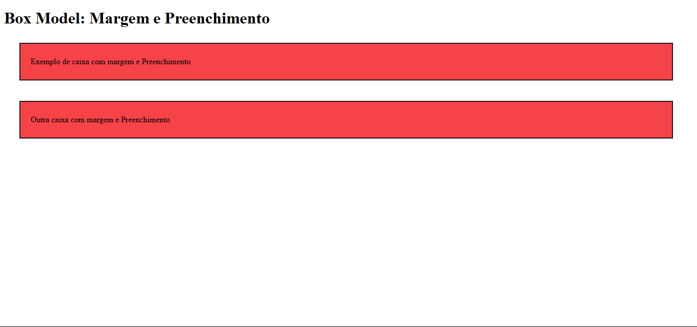

# HTML5 + CSS3 - Box Model: Margin e Padding

Este projeto é um exercício introdutório ao conceito de **Box Model** do CSS, demonstrando o uso prático de **margens** e **preenchimentos (padding)**. A proposta é visualizar como esses espaçamentos afetam os elementos de uma página web, com foco no comportamento de caixas (divs) estilizadas.

---

## 📁 Estrutura de Arquivos

- `index.html`  
  Página HTML principal contendo dois blocos de texto organizados em caixas distintas.

- `style.css`  
  Folha de estilos externa com regras de **margem**, **padding**, **borda** e **cor de fundo** aplicadas às caixas.

---

## 🧪 Aprendizado

- Conceito de **Box Model** no CSS:
  - `margin`: espaçamento externo da caixa.
  - `padding`: espaçamento interno entre o conteúdo e a borda.
  - `border`: contorno da caixa.
- Aplicação de espaçamentos diferenciados nos lados (`top`, `right`, `bottom`, `left`).
- Estilização básica de elementos com `background-color`, `border` e organização de conteúdo.
- Organização do CSS com **classes reutilizáveis**.

---

## 🖼️ Prévia Visual

### 📦 Layout com Box Model

---

## 📝 Licença

Este projeto é destinado exclusivamente para fins **educacionais** e de **prática pessoal**.  
Fique à vontade para modificar, estudar e reutilizar o conteúdo!
